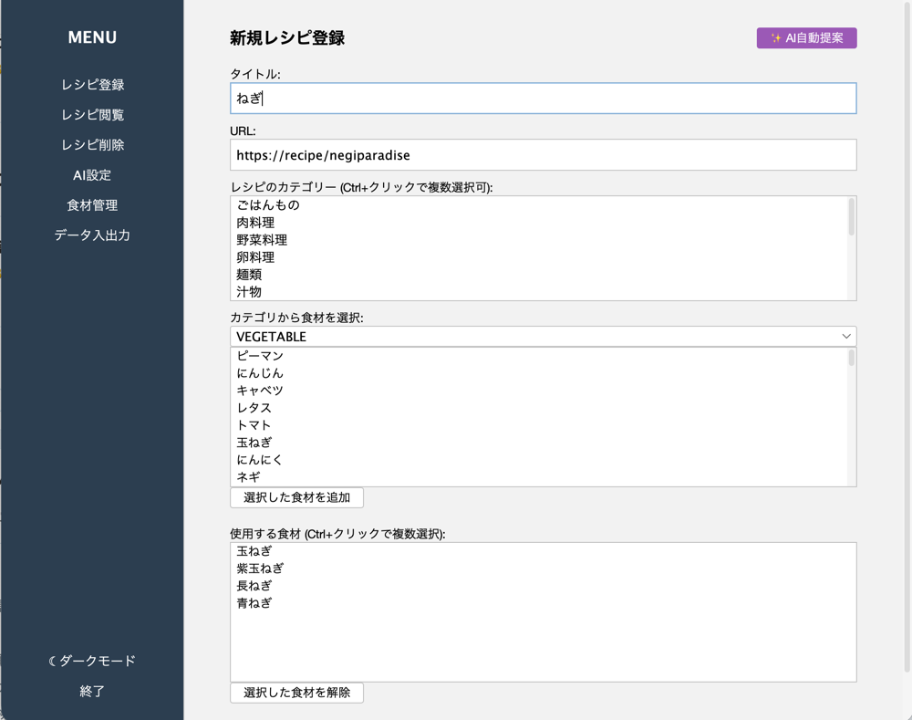
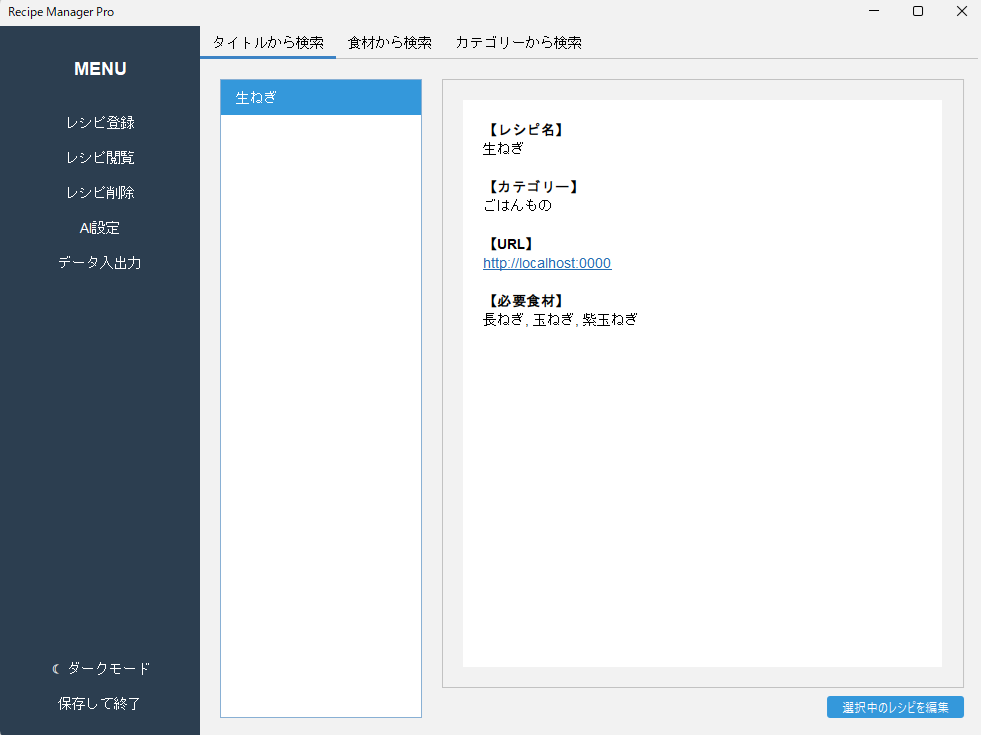
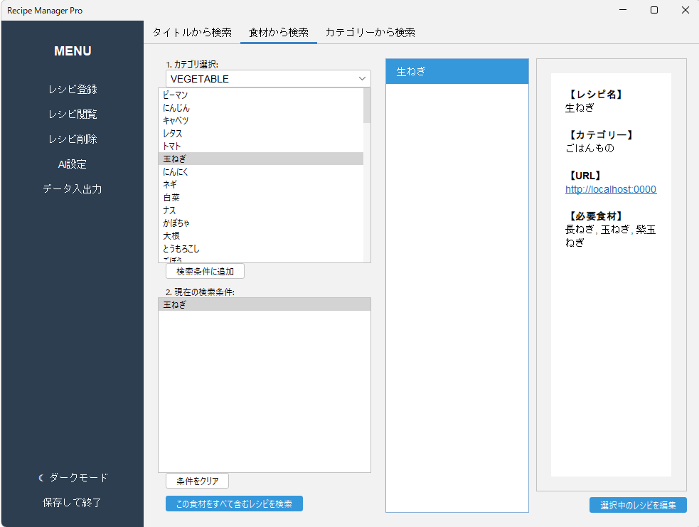
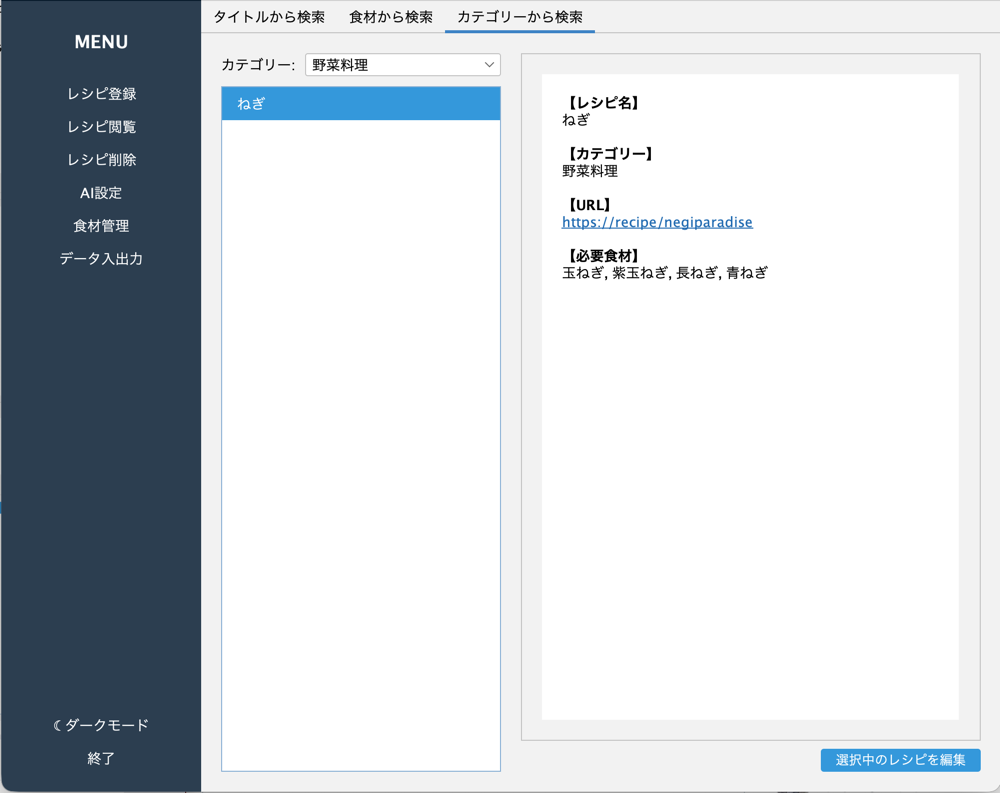
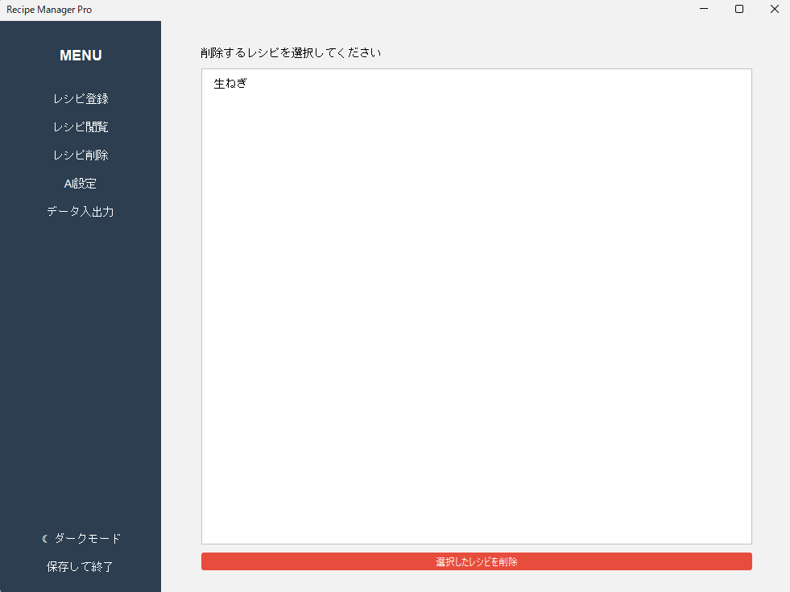
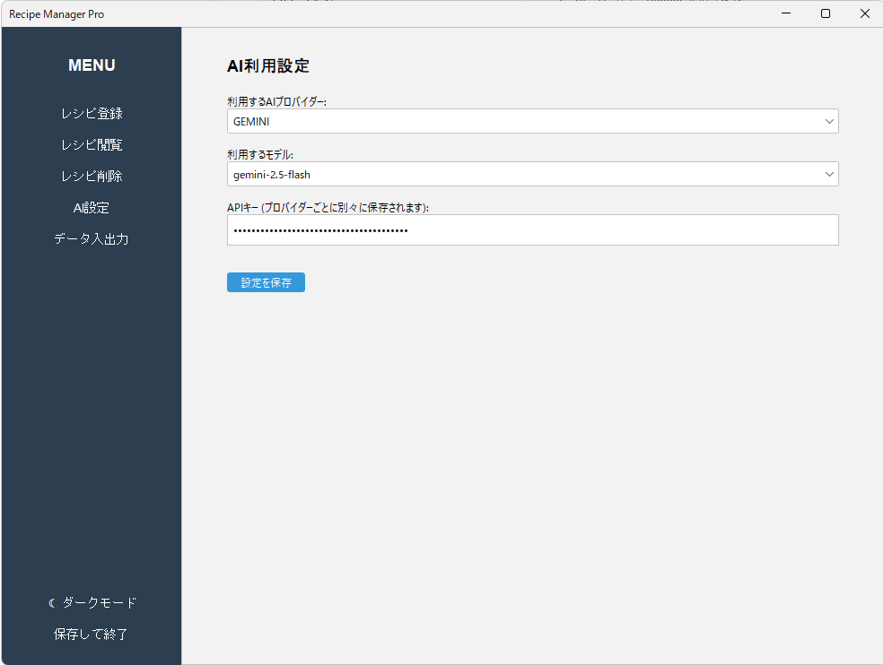
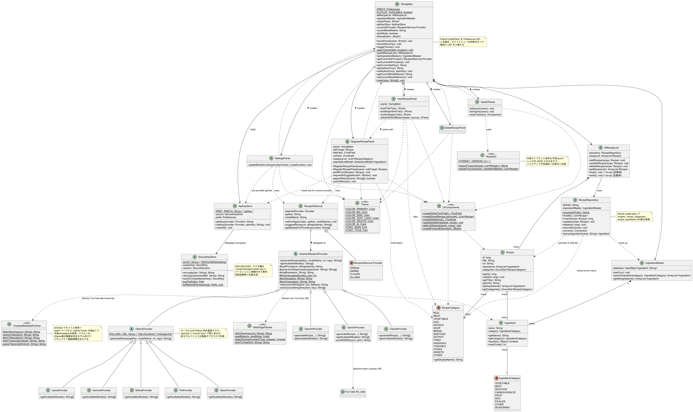

# 概要
- ネット上(クックパッドやYoutubeなど)のレシピを料理するたびに検索するのめんどくさい！
- Youtubeショートでやってみたいレシピあったけど忘れそう！
- 家に残ってる野菜でなんか作れないかな？

そんなあなたに！このアプリ！ネット上のレシピ前提のものは見たことないはず...たぶん...

# 実行方法

## batファイル(推奨起動方法)
事前に **JDK 17 以降** がインストールされていることが前提です。

`run.bat` をダブルクリックするだけで起動できます。初回は数秒のビルド後にウィンドウが開きます。

| ファイル                | 用途                           |
|---------------------|------------------------------|
| **`run.bat`**       | アプリを起動（コンソール非表示）。初回はビルドも自動実行 |
| **`run-debug.bat`** | コンソール付きで起動。エラー調査用            |

## Maven 対応IDE 
pom.xml の依存を解決して `SwingMain` を Run。`lib/` 配下の jar はリポジトリから自動取得されます。

## javac で動かす場合
sqlite-jdbc は SLF4J に依存しているため、3つの jar を `lib/` に揃える必要があります（同梱済み）:

| ファイル                           | 役割                                   |
|--------------------------------|--------------------------------------|
| `lib/sqlite-jdbc-3.45.3.0.jar` | SQLite JDBCドライバ                      |
| `lib/slf4j-api-2.0.13.jar`     | SLF4J API (sqlite-jdbc 必須)           |
| `lib/slf4j-nop-2.0.13.jar`     | SLF4J no-op バインディング (ログ出力を抑止)        |
| `lib/flatlaf-3.4.1.jar`        | モダンな Look and Feel (Light/Dark 切替対応) |

### Windows (PowerShell / cmd)
```
javac -encoding UTF-8 -cp "lib\sqlite-jdbc-3.45.3.0.jar;lib\flatlaf-3.4.1.jar" -d out src\main\java\*.java
java -cp "out;lib\sqlite-jdbc-3.45.3.0.jar;lib\slf4j-api-2.0.13.jar;lib\slf4j-nop-2.0.13.jar;lib\flatlaf-3.4.1.jar" SwingMain
```

### Mac / Linux
```
javac -encoding UTF-8 -cp "lib/sqlite-jdbc-3.45.3.0.jar:lib/flatlaf-3.4.1.jar" -d out src/main/java/*.java
java -cp "out:lib/sqlite-jdbc-3.45.3.0.jar:lib/slf4j-api-2.0.13.jar:lib/slf4j-nop-2.0.13.jar:lib/flatlaf-3.4.1.jar" SwingMain
```

---
# 使い方

## 起動後


サイドメニューの「☾ ダークモード / ☀ ライトモード」ボタンでテーマを切り替えられます。選択は次回起動時にも引き継がれます (Java Preferences API に保存)。

## レシピ登録


タイトル、URL、食材を入力し、レシピ保存ボタンを押すと初回起動時に作成される `recipes.db` (SQLite) に保存されます。

食材は既存のものから選択する方式であり、食材の追加をしたい場合は`database.csv`を編集してください。

| カテゴリー名       | 想定カテゴリー |
|--------------|---------|
| VEGETABLE    | 野菜      |
| MEAT         | 肉系      |
| SEAFOOD      | 海鮮系     |
| CARBOHYDRATE | 炭水化物    |
| FRUIT        | 果物      |
| MILK         | 乳製品     |
| PICKLES      | 漬物、発酵食品 |
| SEASONING    | 調味料     |
| OTHER        | その他     |

AIを登録している場合はURLを入力すると、自動的にタイトルと食材を入力します。(AIの設定は後に記述)

## レシピ閲覧

登録したレシピの閲覧ができます。 レシピは検索方法が3つ あります。

表示されているURLはクリックするとブラウザーが起動します。

また、"右下の選択中レシピを編集"から選択しているレシピを編集することができます。
### タイトルから検索

左側でタイトルを選択すると、右側にレシピの詳細が表示されます。

### 食材から検索

使いたい食材を選択して検索すると真ん中にレシピが表示されます。

食材を複数選んだ場合は全て該当するレシピのみを表示します。

### カテゴリーから検索

カテゴリーを選択するとそれに該当するレシピが表示されます。

## レシピ削除

選んだレシピを削除することができます。

## AI設定

レシピ登録で利用するAIの設定を行います。
AIは4種類から選べます。
- ChatGPT
- Gemini
- Claude
- Ollama

ChatGPTとGeminiとClaudeはAPIキーを用いて、オンラインで処理する方式です。利用可能なモデルやトークン数に注意してください。

Ollamaはローカル環境で処理するものであり、利用デバイス上でOllamaを起動しておく必要があります。

AI設定は保存されます。APIは暗号化した状態で保存します。

### Youtube動画を参照するときについて

YoutubeのURLを利用するときは注意点があります

- GeminiはYoutubeを細かく分析する機能があるため、精度が高いものの、URLが正しい形にならないと上手くいかないです。正規化は行っているものの、Youtubeの仕様変更で動作しなくなる可能性があります。

- Gemini以外はタイトルと字幕から情報を取るため、字幕が無い動画に関してはうまく動作しない可能性があります。
---

# このプログラムをいじりたい人向け


コンポジットを採用し、AIの処理の部分はテンプレートパターンを採用しているが、それでも複雑になっているため、UMLを見ながら頑張れ

---

## メモ書き

レシピのインポート・エクスポートしたい -> dbを使うだけだからいけるでしょう恐らく
AndroidとかiOSとかで動かしたい -> JavaをKotlinやSwingに書き換えればいいため、多分いけるはず
