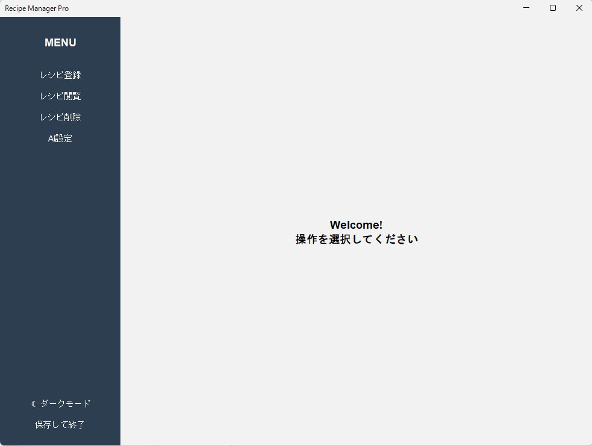

# 概要
- ネット上(クックパッドやYoutubeなど)のレシピを料理するたびに検索するのめんどくさい！
- Youtubeショートでやってみたいレシピあったけど忘れそう！
- 家に残ってる野菜でなんか作れないかな？

そんなことあるよね

そんなあなたに！このアプリ！URLの題名とURLと食材を保存するだけだけれども無いよりかは便利！

# 実行方法

## Maven 対応IDE
pom.xml の依存(`google-genai`, `sqlite-jdbc`)を解決してから `SwingMain` を実行してください。

## javac で動かす場合
sqlite-jdbc は SLF4J に依存しているため、3つの jar を `lib/` に揃える必要があります（同梱済み）:

| ファイル | 役割 |
|---|---|
| `lib/sqlite-jdbc-3.45.3.0.jar` | SQLite JDBCドライバ |
| `lib/slf4j-api-2.0.13.jar` | SLF4J API (sqlite-jdbc 必須) |
| `lib/slf4j-nop-2.0.13.jar` | SLF4J no-op バインディング (ログ出力を抑止) |

### Windows (PowerShell / cmd)
```
javac -encoding UTF-8 -cp "lib\sqlite-jdbc-3.45.3.0.jar" -d out src\main\java\*.java
java -cp "out;lib\sqlite-jdbc-3.45.3.0.jar;lib\slf4j-api-2.0.13.jar;lib\slf4j-nop-2.0.13.jar" SwingMain
```

### Mac / Linux
```
javac -encoding UTF-8 -cp "lib/sqlite-jdbc-3.45.3.0.jar" -d out src/main/java/*.java
java -cp "out:lib/sqlite-jdbc-3.45.3.0.jar:lib/slf4j-api-2.0.13.jar:lib/slf4j-nop-2.0.13.jar" SwingMain
```

レシピは初回起動時に作成される `recipes.db` (SQLite) に保存されます。`recipes.dat` (旧形式) はもう使われません。

---
# 使い方


まだ機能が少ないから見ればわかると思います.

現在AI機能を実装中ですが、動作が不安定な状況なので注意

---
## メモ書き

AndroidとかiOSとかで動かしたい -> Javaだからちょっといじればいけるはず
