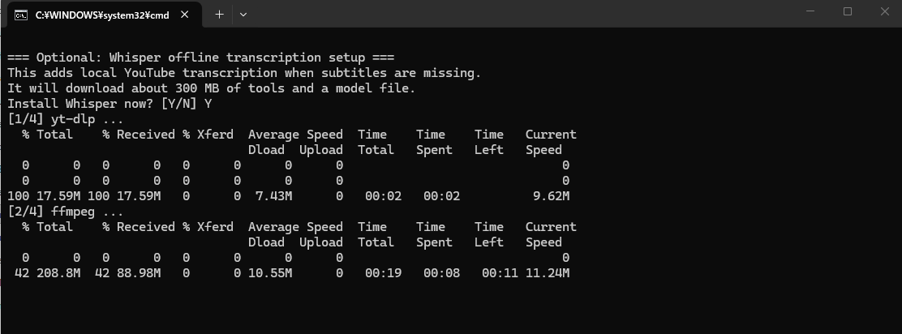
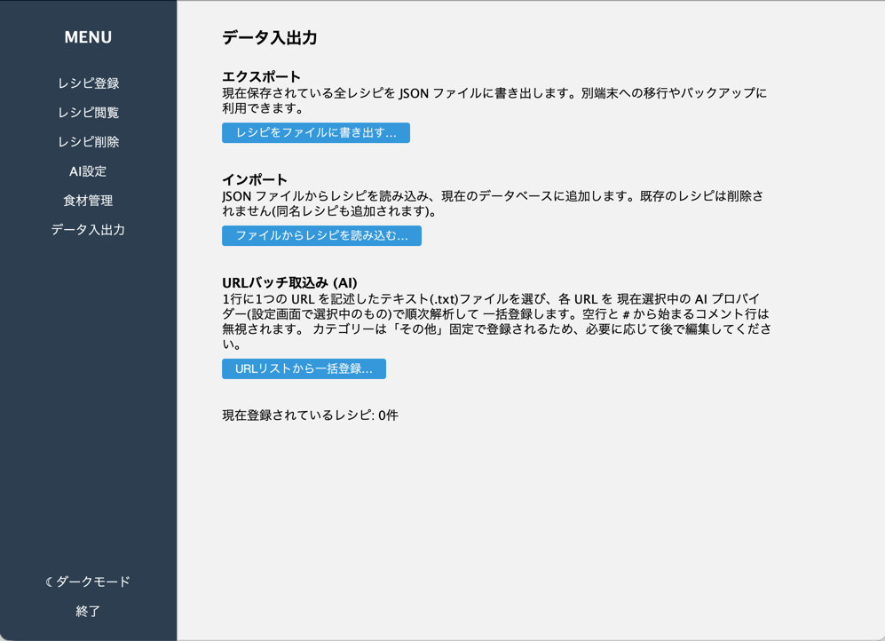

# RecipeManager

## 概要
- ネット上(クックパッドやYoutubeなど)のレシピを料理するたびに検索するのめんどくさい！
- Youtubeショートでやってみたいレシピあったけど忘れそう！
- 家に残ってる野菜でなんか作れないかな？ 

そんなあなたに！タイトルとレシピのURLと食材のみを記録するだけのこのアプリ！

## 背景
- Youtube垢に作ったお料理リストに登録した動画が100を超えてしまい、管理が面倒
- 家にある食材だけで作りたいのに、レシピを調べると何かしらの食材や調味料が不足してる

といったことがあり、作成。あと登録作業面倒だからAIに丸投げできるようにした。

## 前提条件
- Windows または MacOS またはLinux OS
  (Windowsのみbatファイルからの起動に対応、またWhisperはWindowsのみ対応)
- JDK17以降
- Ollama
- Ollamaの対応済みプロバイダ
  - gemma4:e2b
  - gemma4:e4b
  - llama3:8b
  - mistral
  - mistral:7b
  - mistral-nemo
  - mistral-small
  - mixtral
  - phi4
  - phi3.5
  - phi3
  - phi3:mini
  - phi3:medium
  - qwen3.5:4b
  - qwen3.5:9b
  - qwen3-vl:4b
  - qwen3-vl:8b

Ollamaが無くても動作しますが、AI機能はAPIキーを用いるものしか動作しなくなります。

## 使い方
### 実行方法
#### batファイル(推奨起動方法)

`run.bat` をダブルクリックするだけで起動できます。初回はWhisperなどのツールを導入するかを選択してください。
\
初回起動後にWhisperを導入する場合は`setup-whisper.bat`をダブルクリックしてください。

| ファイル                    | 用途                                              |
|-------------------------|-------------------------------------------------|
| **`run.bat`**           | アプリを起動（コンソール非表示）初回はWhisper、ytdlp、ffmpegを導入するか選択 |
| **`run-debug.bat`**     | コンソール付きで起動。エラー調査用                               |
| **`setup-whisper.bat`** | Whisper、ytdlp、ffmpegを導入                         |

#### Maven 対応IDE 
pom.xml の依存を解決して `main.java.SwingMain` を Run。`lib/` の jar はリポジトリから自動取得されます。

#### javac で動かす場合
依存ライブラリの jar 4つは `lib/` に同梱されています:

| ファイル                           | 役割                                   |
|--------------------------------|--------------------------------------|
| `lib/sqlite-jdbc-3.45.3.0.jar` | SQLite JDBCドライバ                      |
| `lib/slf4j-api-2.0.13.jar`     | SLF4J API (sqlite-jdbc 必須)           |
| `lib/slf4j-nop-2.0.13.jar`     | SLF4J no-op バインディング (ログ出力を抑止)        |
| `lib/flatlaf-3.4.1.jar`        | モダンな Look and Feel (Light/Dark 切替対応) |

ソースは `src/main/java/` に `SwingMain.java`、`AI/`・`UI/`・`Recipe/` などのサブパッケージで分かれています。
javac には **エントリポイントの `SwingMain.java` だけ渡し、`-sourcepath` で残りを自動解決** させるのが簡単です。
クラス名はパッケージ込みの `main.java.SwingMain` である点に注意してください。

##### Windows (PowerShell / cmd)
```
javac -encoding UTF-8 ^
      -cp "lib\sqlite-jdbc-3.45.3.0.jar;lib\slf4j-api-2.0.13.jar;lib\slf4j-nop-2.0.13.jar;lib\flatlaf-3.4.1.jar" ^
      -sourcepath src -d out ^
      src\main\java\SwingMain.java

java -cp "out;lib\sqlite-jdbc-3.45.3.0.jar;lib\slf4j-api-2.0.13.jar;lib\slf4j-nop-2.0.13.jar;lib\flatlaf-3.4.1.jar" ^
     main.java.SwingMain
```

##### Mac / Linux
```
javac -encoding UTF-8 \
      -cp "lib/sqlite-jdbc-3.45.3.0.jar:lib/slf4j-api-2.0.13.jar:lib/slf4j-nop-2.0.13.jar:lib/flatlaf-3.4.1.jar" \
      -sourcepath src -d out \
      src/main/java/SwingMain.java

java -cp "out:lib/sqlite-jdbc-3.45.3.0.jar:lib/slf4j-api-2.0.13.jar:lib/slf4j-nop-2.0.13.jar:lib/flatlaf-3.4.1.jar" \
     main.java.SwingMain
```

##### ビルド済みJARから起動する場合
`build.bat` で生成した `RecipeManager.jar` には `Main-Class` と `Class-Path` が記載されているので、
クラスパス指定なしで実行できます:
```
java -jar RecipeManager.jar
```

---
## 使い方

### 起動後


サイドメニューの「☀ ライトモード / ☾ ダークモード」ボタンでテーマを切り替えられます。選択は次回起動時にも引き継がれます (Java Preferences API に保存)。

### レシピ登録


タイトル、URL、食材を入力し、レシピ保存ボタンを押すと初回起動時に作成される `recipes.db` (SQLite) に保存されます。\
食材は既存のものから選択する方式であり、食材の追加をしたい場合は`database.csv`を編集してください。

| カテゴリー名       | 想定カテゴリー |
|--------------|---------|
| VEGETABLE    | 野菜      |
| MEAT         | 肉系      |
| SEAFOOD      | 海鮮系     |
| CARBOHYDRATE | 炭水化物    |
| FRUIT        | 果物      |
| MILK         | 乳製品     |
| PICKLES      | 漬物、発酵食品 |
| SEASONING    | 調味料     |
| OTHER        | その他     |

AIを登録している場合はURLを入力すると、自動的にタイトルと食材を入力します。(AIの設定については下のページ参照)

### レシピ閲覧

登録したレシピの閲覧ができます。 レシピは検索方法が3つ あります。\
表示されているURLはクリックするとブラウザーが起動します。\
また、"右下の選択中レシピを編集"から選択しているレシピを編集することができます。

#### タイトルから検索


#### 食材から検索


#### カテゴリーから検索


### レシピ削除


### AI設定


レシピ登録で利用するAIの設定を行います。
AIは4種類から選べます。
- ChatGPT
- Gemini
- Claude
- Ollama

ChatGPTとGeminiとClaudeはAPIキーを用いてオンライン上で、Ollamaはローカル環境で処理するものとなります。\
AI設定は保存されます。APIキーは暗号化した状態で保存します。

### データ入出力


レシピデータをJSONファイル化し、データ共有することができます。\
インポートしたレシピ内の食材が存在しない場合は、database.csvにOTHERカテゴリーとして登録されます。

---
## 補足
### AIについて
APIを使うものに関しては利用可能なトークン数に注意してください。~~石油王は気にしないでおk~~\
Ollama利用するときは事前にOllamaを起動し、使いたいモデルをDLしてください。
また、モデルによってはデバイスのリソースを大量に取ってしまうため注意。~~石油王h(略)~~\
目安として
- メモリー8GB程度 → 2Bモデル
- メモリー16GB程度 → 4Bモデル
- メモリー16GB程度+VRAM8GB程度 → 8Bモデル
- メモリー32GB程度+VRAM16GB → 12Bモデル

ちなみに自分のM2MacBook(8GB)は2Bモデルで撃沈しました。

### Youtube動画を参照するときについて

- GeminiはYoutubeを分析する機能があるため、Whisperを導入する必要がないです。**なんなら容量の無駄遣いになります。**
- Gemini以外はタイトルと字幕から情報を取るが、ほとんどの動画に字幕がないため、実質的にWhisperが必須です。
---
## ライセンス
### 同梱しているサードパーティライブラリ(`lib`ディレクトリ内)

| ライブラリ | バージョン | ライセンス |
|---|---|---|
| [sqlite-jdbc](https://github.com/xerial/sqlite-jdbc) | 3.45.3.0 | [Apache License 2.0](https://www.apache.org/licenses/LICENSE-2.0) |
| [SLF4J API](https://www.slf4j.org/) | 2.0.13 | [MIT License](https://www.slf4j.org/license.html) |
| [SLF4J NOP](https://www.slf4j.org/) | 2.0.13 | [MIT License](https://www.slf4j.org/license.html) |
| [FlatLaf](https://www.formdev.com/flatlaf/) | 3.4.1 | [Apache License 2.0](https://www.apache.org/licenses/LICENSE-2.0) |

### `setup-whisper.bat` で取得する外部ツール

| ツール | ライセンス | 備考                                      |
|---|---|-----------------------------------------|
| [yt-dlp](https://github.com/yt-dlp/yt-dlp) | [Unlicense](https://github.com/yt-dlp/yt-dlp/blob/master/LICENSE) | パブリックドメイン                               |
| [ffmpeg](https://ffmpeg.org/) (BtbN gpl ビルド) | **[GNU GPL v3](https://www.gnu.org/licenses/gpl-3.0.html)** | `ffmpeg-master-latest-win64-gpl.zip` 利用 |
| [whisper.cpp](https://github.com/ggml-org/whisper.cpp) | [MIT License](https://github.com/ggml-org/whisper.cpp/blob/master/LICENSE) |                                         |
| [ggml Whisper モデル](https://huggingface.co/ggerganov/whisper.cpp) | [MIT License](https://github.com/openai/whisper/blob/main/LICENSE) | OpenAI Whisper                          |

---

#### 今後の予定

- Whisperをはやくlinuxに対応させたい
- AndroidとかiOSとかで動かしたい
